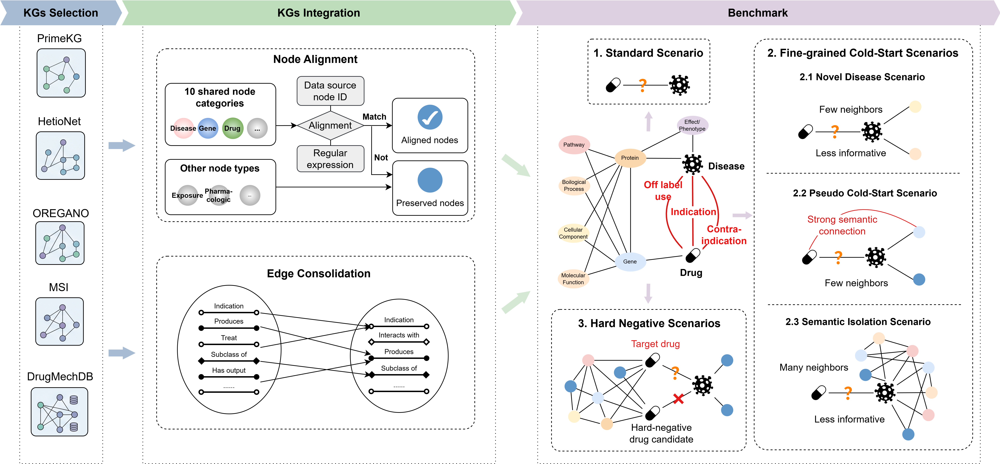

# DrugRepBench: a multi-scenario benchmark for knowledge graph-based drug repurposing
This repository is the official implementation of "DrugRepBench: a multi-scenario benchmark for knowledge graph-based drug repurposing".

## Overview of DrugRepBench


## Requirements

To install requirements:

```setup
pip install -r requirements.txt
```

## Data Processing

We will use two KG examples to demonstrate the process of creating our benchmark. First, navigate to the directory ***data_process*** and run the ***1merge.py*** file to merge the two KG files.

```
cd data_process
python 1merge.py
```

Then, run file ***2kg_build.py*** to build a new KG based on the merged information.

```
python 2kg_build.py
```

The test samples for **Fine-grained Cold-Start Scenarios** can be obtained by running file 3kg_divide.py.

```
python 3kg_divide.py
```

Running ***4hard_negative.py*** can obtain data information for the **Hard Negative Sampling Scenario**, but you need to first construct the __embedding__ of the KG node and the __mechanistic difference set__ of the candidate drugs.

## DrugRepBench

The content of benchmark **DrugRepBench** is located under the directory ***benchmark*** and includes graph.txt, train.txt, valid.txt, and three test Scenarios.